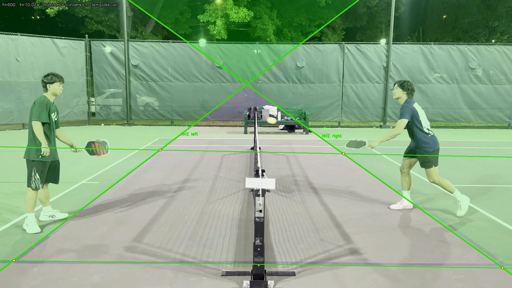
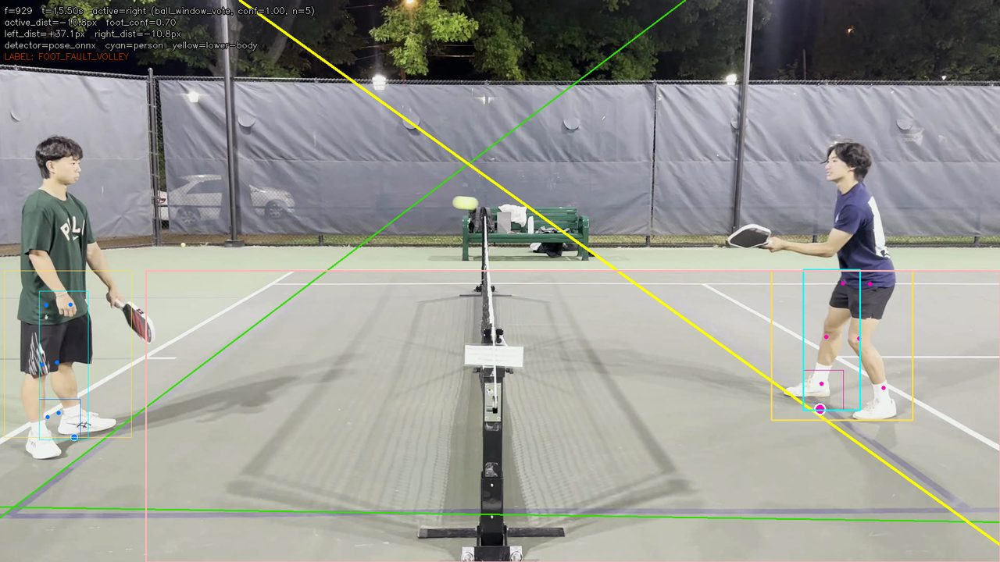
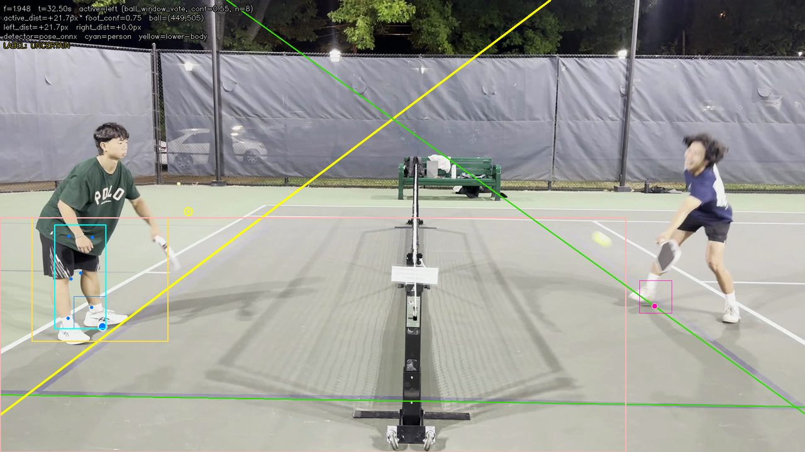

# KitchenMaster

Single-camera pickleball kitchen fault review prototype.

Kitchen faults are hard because the call depends on two things at once: where the foot is, and when the volley happened. KitchenMaster is an offline computer vision pipeline that takes fixed side-view video, registers the non-volley zone (NVZ) geometry, tracks candidate ball events, estimates the relevant foot point, and exports `legal_volley`, `foot_fault_volley`, or `uncertain` review artifacts.

The goal is not to replace a referee. The useful version of this project is a review tool: flag the suspicious frame, show the geometry, and make uncertainty visible instead of forcing a bad call.



## Results

| Area | Result |
| --- | --- |
| Court registration | `2055 / 2055` frames registered on the real demo clip with `0` fallbacks |
| Synthetic classifier | `200` generated samples, `0.0%` false-fault rate, `0.0%` missed-fault rate on clear cases |
| Uncertainty behavior | `27.0%` uncertain rate on synthetic borderline and occluded samples |
| Real-video review | `3` saved candidate volley frames reviewed: active-side run labeled `1` fault / `2` uncertain; known-side check labeled `2` fault / `1` uncertain |

These numbers are intentionally narrow. The synthetic benchmark tests the geometry classifier under clean conditions. The real-video demo shows the pipeline running end to end, but three events from one clip are not enough to claim general accuracy.

## Demo Frames

| Detected fault event | Uncertain review event |
| --- | --- |
|  |  |

## Pipeline

1. Register the court from manually labeled NVZ anchors.
2. Track ball candidates with classical CV and optional YOLO support.
3. Classify candidate volley or bounce frames from the trajectory.
4. Estimate the relevant foot point with boundary-aware ROI logic and optional pose guidance.
5. Compute signed pixel distance from the foot point to the NVZ boundary.
6. Export event CSVs, annotated frames, and review files for human correction.

The strongest part is court geometry. Ball tracking and active-side inference are the weak points, especially in night footage with glare, shadows, and small fast-moving balls.

## Engineering Highlights

- Built an interpretable OpenCV pipeline from court geometry through event review instead of a black-box classifier.
- Implemented anchor-based NVZ geometry, ORB/RANSAC stabilization, signed-distance labels, and human override files.
- Kept the project research-honest: clear cases are surfaced, ambiguous calls become `uncertain`, and limitations are documented.
- Split heavyweight demo dependencies and generated assets out of the default install path so the repo is easier to review.

## Quickstart

```bash
python3 -m venv .venv
source .venv/bin/activate
pip install -r requirements.txt

pytest tests/

python experiments/run_sim.py --config experiments/configs/sim_v1.yaml
python experiments/run_eval.py --results results/sim_v1/
```

Real-video runs need local raw clips under `.local/data/real/videos/`. Those videos, extracted frames, local archives, and model weights are ignored by git so the public repo stays focused.

For the YOLO-backed ball detector used by the demo config:

```bash
pip install -r requirements-demo.txt
```

## Main Commands

```bash
# Court registration on a prepared clip
python experiments/run_court_registration_v3.py \
  --config experiments/configs/court_reg_v3.yaml

# End-to-end review pass. The demo config uses the optional YOLO backend.
python experiments/run_demo_pipeline.py \
  --config experiments/configs/demo_pipeline.yaml

# Apply user-reviewed overrides
python experiments/run_demo_pipeline.py \
  --config experiments/configs/demo_pipeline.yaml \
  --mode apply_overrides
```

## Repository Map

```text
src/
  court_model.py            anchor-based NVZ geometry
  stabilizer.py             ORB, RANSAC, and translation tracking
  ball_tracker.py           candidate ball detections and trajectory export
  volley_classifier.py      bounce and volley candidate logic
  foot_localizer.py         boundary-aware foot point estimation
  foot_fault_pipeline.py    signed-distance event labeling
  sim_generator.py          synthetic benchmark frames
  evaluate.py               metrics and failure analysis

experiments/
  run_sim.py
  run_court_registration_v3.py
  run_demo_pipeline.py
  configs/

scripts/
  annotate_anchors.py
  annotate_reprojection_anchors.py
  extract_frames.py

docs/
  assets/                   README images and charts
  annotations/              small real-video anchor annotations
  results/                  small result summaries from the final report
```

## Limits

- The real-event dataset is still small.
- The classifier uses image-pixel distance, not calibrated world coordinates.
- Ball tracking can fail when the ball blends into lights, shadows, or court glare.
- Active-side inference can choose the wrong NVZ boundary, which changes the final label.
- The current system is offline and review-oriented, not a streaming officiating product.

## Why This Project Matters

A false foot-fault call is worse than no call in casual play. KitchenMaster treats that as an engineering constraint. It makes clear cases easy to inspect and sends borderline cases to review, which is the safer behavior for a one-camera prototype.
